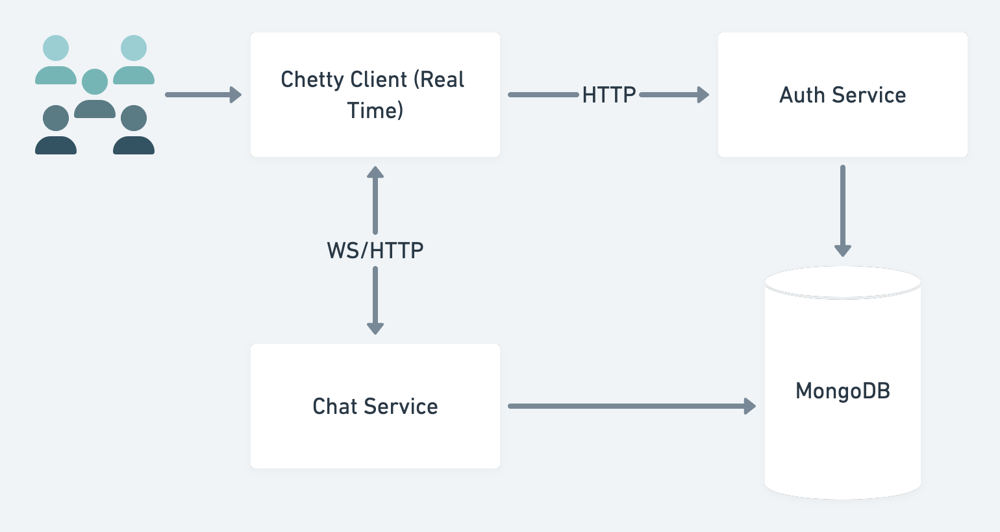

# Chetty

A simple chat application which is able to send messages and
display messages from all senders:



A simple backend with an API for messages that reads and writes data from a database, and a
frontend to interact with that API.

API features:

```
1. Receive new messages from the client
2. List all messages in chronological order for the client
```

Runnable locally using `docker-compose`. 
